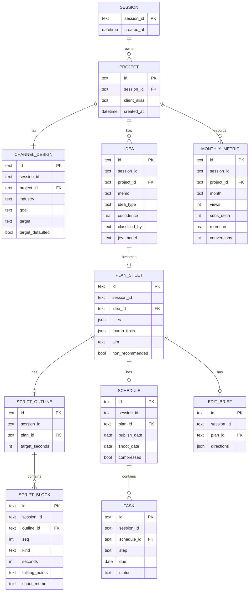
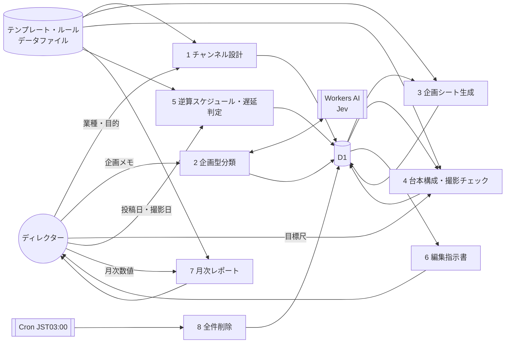
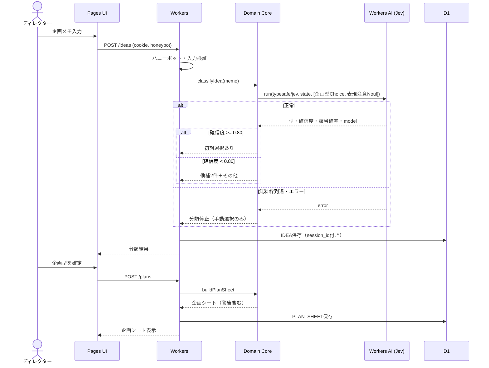
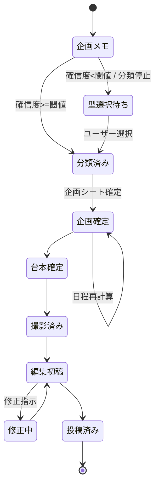
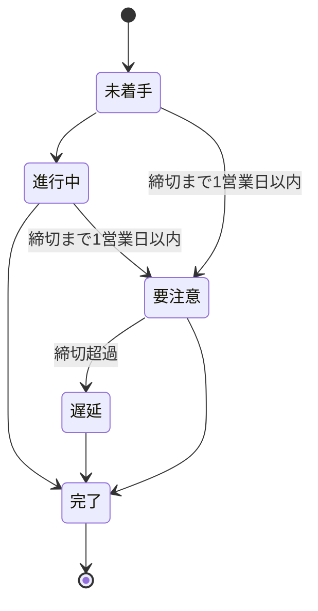
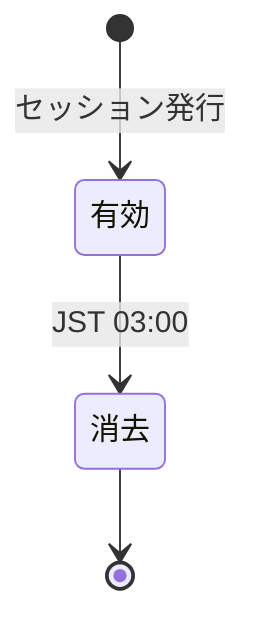
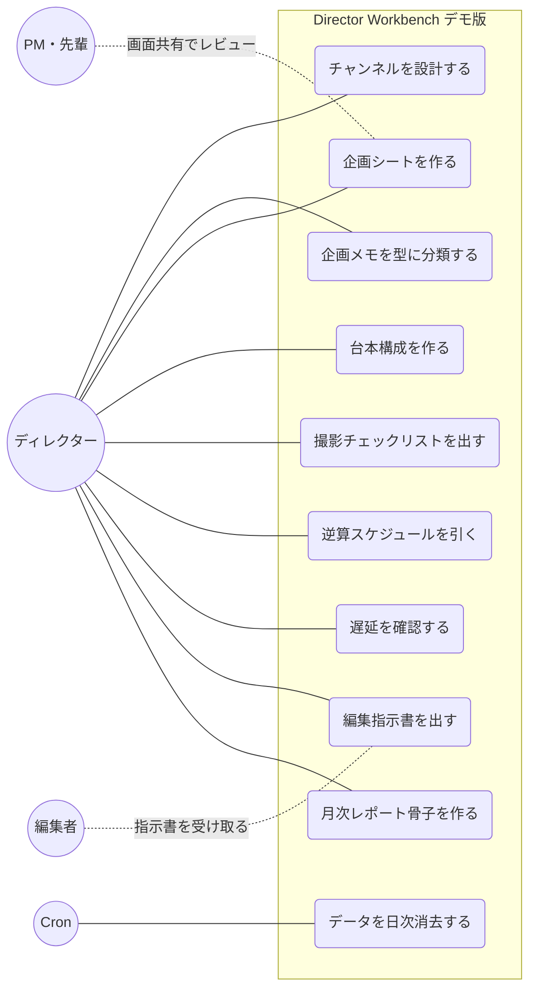

# yt-director-workbench-demo 仕様書（デモ版）

- リポジトリ名：`yt-director-workbench-demo`
- プロダクト名：Director Workbench（デモ版）
- 対象エディション：デモ版（アイデアの視覚化）
- 文書基準日：2026-10-09

---

## 1. 概要

法人クライアントのYouTubeチャンネルを「企画・台本・撮影・編集指示・効果検証・改善提案」まで一貫して担当するディレクターの業務を、1つの画面の流れで支援するウェブアプリケーションである。

デモ版は、未経験から参画したディレクターが「型」に沿って成果物（企画シート・台本構成・制作スケジュール・編集指示書・月次レポート骨子）を作れる体験を見せる展示物とする。生成はすべてテンプレートとルールで行い、自由記述の企画メモの型分類のみJevで行う。

## 2. 解決する課題

| 業務 | 課題 | 本ツールが出すもの |
|---|---|---|
| 企画立案 | 業種・目的から逆算した企画を毎回ゼロから考えている | 業種×目的×企画型に基づく企画シート |
| 台本構成 | 出演者が話す構成の粒度が人によって異なる | 企画型ごとの構成と秒数配分 |
| 進行管理 | 投稿日から逆算した日程調整が属人的 | 投稿日起点の逆算スケジュールと遅延判定 |
| 撮影ディレクション | 現場での指示漏れ | 台本構成から派生する撮影チェックリスト |
| 編集者ディレクション | 編集意図の伝達漏れ | 編集指示書 |
| 月次定例 | 成果の整理と次の施策提案に時間がかかる | 前月比の算出と施策候補の骨子 |

## 3. プラットフォーム選定

- **選定：ウェブ（Cloudflare簡略構成：Workers／Pages＋D1）**
- ターゲット判別：成果物を直接操作するのはディレクター（人間）であるため人間向けとする。
- 電子書籍を選ばない理由：業種・目的・投稿日などの入力に応じて出力（企画シート・日程）が変わるため。
- 動画を選ばない理由：時間軸の提示ではなく、入力に応じた生成と管理が中核であるため。
- スマホ・デスクトップを選ばない理由：オフィス・撮影現場の双方で、インストール不要で開ける必要があるため。デモ版はローカルLLMを要しないため、デスクトップ選択の検討条件にも当たらない。
- Cloudflare簡略構成を選ぶ理由：処理はCRUD・テンプレート展開・日付計算・Jevによる分類のみで、FastAPI・LangChain・OCR等の重い処理を要しない。Jevによる分類はこの構成でのみデモ版で利用できる。

## 4. デモ版の制約適用

| 項目 | 扱い |
|---|---|
| 実装方式 | 1issueのワンショット実装 |
| 外部API | 使用しない。Gemini・GPT・AWS Polly等のクラウドAPIはデモ版では一切呼び出さない。JevのみWorkers AIバインディング経由で例外とする |
| 認証 | なし |
| セッション | Cookie＋D1（SQLite）。セッションIDを全テーブルのオーナーキーとする |
| DB | D1（SQLite）。毎日JST 03:00に全件削除（Cron Trigger：UTC 18:00） |
| Bot対策 | ハニーポット（不可視の入力欄に値があるリクエストを破棄） |
| AI生成 | 企画文・台本文のLLM生成は行わない。テンプレート置換で代替し、要約は先頭N文字の抜粋で代替する |
| 個人情報 | 氏名・メール・住所・電話・生年月日の入力欄を持たない。クライアント名は任意の呼称（例「A社」）とし、実名入力を促さない注意書きを入力欄に表示する |
| デザイン・測定・保守・監視 | いずれも行わない（既定スタイル） |

## 5. 技術構成

| 層 | 技術 |
|---|---|
| フロント | Cloudflare Pages（静的UI、TypeScript） |
| API | Cloudflare Workers（TypeScript） |
| DB | Cloudflare D1 |
| 分類 | Workers AI `typesafe/jev`（バージョン固定：`jev-1.13.0`） |
| 定期処理 | Workers Cron Triggers |
| プラン | Workers Free（固定） |

### 5.1 Domain Coreの分離

```text
             ┌─ Human Interface : Pages UI
Domain Core ─┤
             └─ (将来) API / CLI / MCP は薄いアダプタとして追加可能
```

Domain Coreは以下の純粋なモジュールで構成し、HTTP・D1・Workers AIに依存しない。外部依存はポート（`ProjectRepository`・`IdeaClassifierPort`・`Clock`）経由で注入する。

### 5.2 リポジトリ構成

```text
yt-director-workbench-demo/
├─ src/
│  ├─ frontend/        # Pages
│  ├─ backend/         # Workers（アダプタ層）
│  └─ core/            # Domain Core（I/Oなし）
│     ├─ templates/    # 業種・目的・企画型・構成テンプレート（データ）
│     └─ rules/        # 日程逆算・遅延判定・前月比・施策ルール
├─ migrations/         # D1スキーマ
└─ test/
```

## 6. マスタデータ

テンプレートはコードから分離したデータファイルで保持する。

| マスタ | 件数 | 内容 |
|---|---|---|
| 業種 | 6 | 転職エージェント／クリニック／工務店・不動産／士業／BtoB／採用 |
| 目的 | 3 | 集客／採用／売上 |
| 企画型 | 8 | ノウハウ解説／よくある質問／ビフォーアフター・事例／1日密着／代表・院長対談／ランキング・比較／お悩み相談／社員インタビュー |
| 業種×目的→推奨企画型 | 18 | 各組合せに推奨3型＋非推奨型 |
| 構成テンプレート | 8 | 企画型ごとのブロック列（フック／問題提起／本論／事例／まとめ／CTA）と秒数比率 |
| タイトル型 | 24 | 企画型ごとに3型（数字型・疑問型・断言型） |
| サムネ文言型 | 16 | 企画型ごとに2型 |
| 業種別表現注意 | 6 | 業種ごとの禁止・要注意表現（例：クリニックの効果断定、士業の報酬比較） |
| 工程定義 | 6 | 企画確定／台本確定／撮影／編集初稿／修正／投稿と標準所要営業日 |
| 施策ルール | 12 | 指標変化パターン→施策候補 |
| 合計 | 117件 | |

## 7. 機能仕様（Domain Core関数）

### 7.1 `designChannel(industry, goal, target)`

- 入力：業種（必須・6択）、目的（必須・3択）、ターゲット像（任意・200字以内）
- 処理：業種×目的の推奨企画型3つと非推奨型を返す。ターゲット像が空のときは業種別の既定ターゲット像を補完し、補完したことを明示する。
- 出力：チャンネル設計（目的・ターゲット・推奨企画型・業種別表現注意）

### 7.2 `classifyIdea(memo)`

- 入力：自由記述の企画メモ（1〜500字）
- 処理：Jev（Choice）で企画型8択から1つを判定する。同一呼び出しで「業種別表現注意に抵触するか」（Noul）も併せて判定する（questionsを並列に渡す）。
- 分岐：
  - 確信度0.80以上：判定結果を初期選択として提示する（ユーザーは変更可）
  - 確信度0.80未満：判定せず、上位候補2つと「その他」を並べてユーザーに選ばせる
  - 表現注意の該当確率0.50以上：該当しうる注意事項を表示する（最終判断はユーザー）
- 例外：無料枠到達・Jevエラー時は分類機能をエラーとして停止し、企画型の手動選択のみ受け付ける。ルールベース分類へフォールバックしない。
- 応答の`model`値を企画レコードに記録する。
- 1字以下・空白のみ・500字超は呼び出し前に入力エラーとする。

### 7.3 `buildPlanSheet(channel, ideaType, memo)`

- 処理：タイトル案3（タイトル型テンプレートに業種語・ターゲット語を置換）、サムネ文言案2、狙い（目的から逆算した1文）、想定視聴者、企画概要（メモ先頭120字の抜粋）を生成する。
- 選んだ企画型が非推奨型のときは理由とともに警告を出すが、作成は止めない。
- タイトル案は40字を超えないよう置換語を短縮形に切り替え、それでも超える場合は警告を付ける。

### 7.4 `buildScriptOutline(plan, targetSeconds)`

- 入力：目標尺（60〜1800秒、既定480秒）
- 処理：企画型の構成テンプレートの秒数比率を目標尺に掛け、各ブロックの秒数を整数で配分する。端数は本論ブロックに寄せ、合計を目標尺に一致させる。
- 60秒未満の尺（ショート）は、フック・本論・CTAの3ブロックに縮約する。
- 各ブロックに「話すことの要点」欄（出演者が埋める空欄）と撮影メモ欄を持つ。
- 出力の派生として撮影チェックリスト（ブロックごとの必要カット・小道具・立ち位置）を生成する。

### 7.5 `scheduleBackward(publishDate, today, shootDate?)`

- 処理：投稿日から工程定義の標準所要営業日を逆算し、各工程の締切日を求める。営業日は土日を除く（祝日は対象外とし、その旨を画面に表示する）。
- 撮影日が指定された場合はそれを固定し、前後の工程を再配分する。撮影日以降の工程が標準所要日数を満たさないときは「圧縮」警告を出す。
- 投稿日が今日以前、または最初の工程締切が今日より前のときは「日程不足」を返し、最短で可能な投稿日を提示する。
- 日付の比較・計算はすべてコードで行い、Jevに委ねない。

### 7.6 `judgeDelay(project, today)`

- 各工程の状態と締切日から、遅延なし／要注意（締切まで1営業日以内で未完了）／遅延（締切超過）を判定する。

### 7.7 `buildEditBrief(outline, plan)`

- 処理：台本構成の各ブロックを、テロップ方針・BGM方針・カット割りの指示を持つ編集指示書に変換する。業種別表現注意をテロップ方針に転記する。
- 納期は`scheduleBackward`の編集初稿締切を引用する。

### 7.8 `buildMonthlyReport(current, previous)`

- 入力：当月・前月の再生数、登録者増減、視聴維持率、問い合わせ・応募数（いずれも手入力、0以上の整数・維持率は0〜100）
- 処理：前月比（差分と変化率）を算出する。前月が0の場合は変化率を算出せず「前月実績なし」と表示する。前月未入力の場合は当月値のみ表示する。
- 施策ルールに照らして施策候補を最大3件出す（例：再生増かつ問い合わせ横ばい→概要欄・CTAの導線見直し）。
- 算術はすべてコードで行う。

## 8. 画面構成

1. ホーム（案件一覧・遅延表示）
2. チャンネル設計
3. 企画メモ→企画シート
4. 台本構成・撮影チェックリスト
5. スケジュール
6. 編集指示書
7. 月次レポート

各成果物はクリップボードへコピーできるプレーンテキスト／Markdownで出力する。

## 9. 設計原則

- **型の外に出ても止めない**：非推奨企画型・尺の圧縮・タイトル字数超過は警告とし、作成は継続できる。ディレクターの判断を上書きしない。
- **分類の結論は確定させない**：Jevの判定は初期値にとどめ、確信度が閾値未満なら候補提示に切り替える。
- **計算はコード**：秒数配分・日程・前月比は決定的なコードで行い、同一入力に同一出力を返す。
- **欠損時は補完を明示**：任意項目の既定値補完は、補完した旨を画面に出す。
- **停止は明示**：Jevの無料枠到達時は「本日の自動分類は終了」と表示し、手動選択に限定する。
- **データの分離**：全テーブルの全クエリにセッションIDの条件を付与し、他セッションのデータを参照・更新・削除できない。
- **リセットの周知**：毎日JST 03:00に全データが消える旨を全画面のフッターに表示する。

## 10. 非機能要件

- 入力値はすべてサーバー側で再検証する（列挙値・文字数・日付形式・数値範囲）。
- 出力文字列はHTMLエスケープして表示する。
- Workers AIの1日無料枠（10,000 Neurons）を超えた呼び出しはエラーとして扱い、課金プランへ移行しない。
- Jev呼び出しはWorkers AI経由のコンテキスト上限（32kトークン）を前提とし、入力は企画メモ500字に限る。

## 11. 参照情報（参照日：2026-10-09）

- Jevモデル・料金・上限：https://docs.typesafe.ai/models
- 答えの型：https://docs.typesafe.ai/primitives
- 確信度：https://docs.typesafe.ai/confidence
- 既知の限界：https://docs.typesafe.ai/model-jaggedness/jev-1.13
- Workers AI経由のJev：https://developers.cloudflare.com/ai/models/typesafe/jev/
- Workers AI料金・無料枠：https://developers.cloudflare.com/workers-ai/platform/pricing/

---

## 12. ER図



全テーブルが`session_id`を保持し、マスタデータはDBに置かずデータファイルとして同梱する。

## 13. DFD



## 14. シーケンス図（企画メモから企画シートまで）



## 15. クラス図（Domain Core）

```mermaid
classDiagram
    class ChannelDesigner { +designChannel(industry, goal, target) ChannelDesign }
    class IdeaClassifier { -port IdeaClassifierPort +classifyIdea(memo) Classification }
    class IdeaClassifierPort { <<interface>> +classify(state, questions) RawResult }
    class PlanSheetBuilder { +buildPlanSheet(channel, type, memo) PlanSheet }
    class ScriptOutliner { +buildScriptOutline(plan, seconds) ScriptOutline +shootChecklist(outline) Checklist }
    class Scheduler { -clock Clock +scheduleBackward(publish, today, shoot) Schedule +judgeDelay(project, today) DelayStatus }
    class EditBriefBuilder { +buildEditBrief(outline, plan) EditBrief }
    class MonthlyReporter { +buildMonthlyReport(cur, prev) Report }
    class TemplateCatalog { +recommended(industry, goal) +outline(type) +titles(type) +cautions(industry) +steps() +measures() }
    class ProjectRepository { <<interface>> +save(sessionId, entity) +find(sessionId, id) }
    class Clock { <<interface>> +today() Date }

    IdeaClassifier --> IdeaClassifierPort
    ChannelDesigner --> TemplateCatalog
    PlanSheetBuilder --> TemplateCatalog
    ScriptOutliner --> TemplateCatalog
    Scheduler --> TemplateCatalog
    Scheduler --> Clock
    EditBriefBuilder --> TemplateCatalog
    MonthlyReporter --> TemplateCatalog
```



`IdeaClassifierPort`のWorkers AI実装と`ProjectRepository`のD1実装はアダプタ層（`src/backend/`）に置く。

## 16. 状態遷移図

### 16.1 企画（案件の制作工程）



### 16.2 工程タスク



### 16.3 データ寿命



## 17. ユースケース図



PM・編集者はアカウントを持たず、ディレクターがコピーして渡した成果物を受け取る（デモ版は認証を持たないため）。
